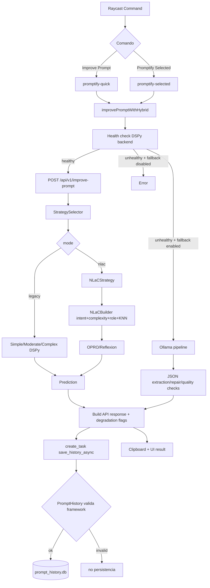
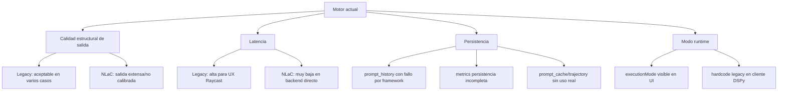

# Prompt Improve Engine Review (2026-02-21)

## Contexto y objetivo
Este documento resume una exploracion tecnica del motor de `prompt improve` para:
- mapear el flujo end-to-end,
- identificar tecnicas activas por ruta,
- verificar persistencia y uso real de SQL,
- medir latencia por modo (`legacy` vs `nlac`),
- priorizar mejoras para estabilizar el motor antes de habilitar de nuevo NLaC en produccion.

---

## 1) Flujo completo de una solicitud



---

## 2) Tecnicas activas por motor

### 2.1 Legacy DSPy
- Enrutamiento por complejidad: `simple`, `moderate`, `complex`.
- `simple`: `dspy.Predict`, truncado max 800 chars.
- `moderate`: `dspy.ChainOfThought`, truncado max 2000 chars.
- `complex`: `KNNFewShot` (k=3), truncado max 5000 chars.

### 2.2 NLaC
- Pipeline unificado: intent classifier + complexity analyzer + role injection.
- Builder con KNN examples (si catalogo disponible).
- RaR para prompts complejos.
- OPRO (hasta 3 iteraciones) para no-debug.
- Reflexion para debug.
- Validacion IFEval declarada pero no activada como parte completa del flujo.

### 2.3 Ollama path (fallback/local)
- System/User prompt separado.
- Hard rules anti prompt-injection y formato JSON estricto.
- Extraccion robusta de JSON.
- Segundo intento de reparacion cuando detecta issues de calidad.
- Normalizacion de salida (preguntas extraidas fuera de `improved_prompt`).

---

## 3) Estado operativo real de SQL

### 3.1 Base de datos y tablas
- `data/prompt_history.db` existe y migra schema v2 correctamente.
- `data/metrics.db` existe.

Tablas en `prompt_history.db`:
- `prompt_history`
- `prompts`
- `test_cases`
- `opro_trajectory`
- `prompt_cache`
- `schema_info`

### 3.2 Conteos actuales
- `prompt_history`: **212**
- `prompts`: **0**
- `opro_trajectory`: **0**
- `test_cases`: **0**
- `prompt_cache`: **0**

### 3.3 Interpretacion
- SQL engine esta operativo (archivos y tablas ok).
- Persistencia NLaC avanzada (cache/trajectory/prompts) no se esta alimentando en runtime.
- `metrics.db` inicializa repositorio, pero en flujo principal la persistencia de metricas esta marcada como pendiente.

---

## 4) Hallazgo critico de persistencia

### Sintoma
Una llamada valida a `/api/v1/improve-prompt` responde correctamente, pero `prompt_history` no incrementa.

### Causa raiz
`PromptHistory` valida `framework` contra enum estricto:
- valores permitidos: `chain-of-thought`, `tree-of-thoughts`, `decomposition`, `role-playing`.
- el modelo en runtime a veces devuelve texto libre largo en `framework` (por ejemplo "Decomposition: ..."), lo que dispara `ValueError`.
- `_save_history_async` captura `ValueError` y registra failure; la respuesta al usuario sigue siendo exitosa.

### Impacto
- No hay trazabilidad confiable para analisis posterior de calidad/latencia por estrategia.
- Dificulta validar empiricamente mejoras del motor.

---

## 5) Latencia: benchmark actual

Se ejecuto benchmark backend directo (5 casos por modo, mismo servidor local):

### Legacy
- latencias: **7.8s - 12.0s**
- estrategias observadas: `simple` y `moderate`
- confianza tipica: ~0.92
- longitudes: 731-1342 chars

### NLaC
- latencias: **0.03s - 0.04s**
- estrategia: `nlac`
- confianza: `null`
- longitudes: 5790-7985 chars (muy largas)

### Lectura tecnica
- En este estado del backend, NLaC no es lento; es rapido pero produce salidas sobredimensionadas y sin score de confianza util.
- La experiencia de latencia alta que reportaste es consistente con que el frontend este cayendo en `legacy` (o historial de timeout previos), no con el NLaC actual backend-only.

---

## 6) Mismatch clave frontend/backend (executionMode)

Existe un desacople importante:
- UI `promptify-quick` expone `executionMode` con default `nlac`.
- pero el cliente DSPy fuerza internamente `mode = "legacy"` al hacer POST.

Con esto, aunque usuario seleccione `nlac`, la ruta principal termina en legacy.


---

## 7) Memoria para mejorar futuros prompts

### Lo que SI existe
- Modelo de cache SHA256 (`PromptCache`) y tablas SQL para cache/trajectory.
- Historial local en Raycast (`~/.raycast-prompt-improver/prompts/history.jsonl`) para UX.

### Lo que NO esta cerrado en produccion
- Pipeline principal no consume/escribe de forma efectiva `prompt_cache` / `opro_trajectory`.
- Persistencia de metricas no esta integrada de extremo a extremo.
- Historial backend tiene failures silenciosos por validacion de `framework`.

---

## 8) Evaluacion del estado del motor (resumen)



---

## 9) Prioridades de estabilizacion (motor primero)

## P0 (bloqueantes)
1. Corregir propagacion de `mode` (quitar hardcode `legacy` en cliente DSPy).
2. Normalizar `framework` antes de construir `PromptHistory` (map a enum permitido).
3. Hacer visible cuando falla persistencia (metrica/alerta explicita, no silenciosa).

## P1
1. Definir contrato de calidad para NLaC (longitud maxima, estructura esperada, confidence).
2. Persistir metricas en `metrics.db` desde flujo principal (no solo calcular).
3. Añadir comparador estable `legacy vs nlac` sobre dataset con tiempos y quality gates.

## P2
1. Activar memoria de mejora real (usar `prompt_cache` y/o `opro_trajectory` en runtime).
2. Revisar umbrales de complejidad para reducir sobreuso de `simple`.

---

## 10) Conclusion ejecutiva
- `executionMode` debe mantenerse como capacidad del sistema, pero hoy no representa el comportamiento real por el hardcode a `legacy`.
- SQL esta operativo como infraestructura, pero la persistencia funcional del flujo principal esta incompleta/fragil.
- Antes de reactivar NLaC en produccion, conviene cerrar primero el motor: modo real, persistencia confiable, metricas persistidas y quality gates comparativos.

---

## 11) Prompt baseline para siguiente fase (ejemplo de comparacion)

Este prompt se deja como baseline para comparar calidad al final de la siguiente fase:

```text
Actúa como un Senior Technical Project Architect especializado en migraciones y hardening de sistemas de prompting.

Objetivo: Crear un plan de ejecución para cerrar P0 del motor de Prompt Improver antes de reactivar NLaC en producción.

P0 a resolver:
- P0-1: Propagación real de executionMode (eliminar hardcode legacy y respetar legacy/nlac end-to-end).
- P0-2: Corregir persistencia de prompt_history normalizando framework a enum válido antes de guardar.
- P0-3: Hacer observable cualquier falla de persistencia (logs estructurados, flags de degradación, métricas verificables).

Divide el trabajo en WorkOrders secuenciales y pequeños (WO-001, WO-002, WO-003), y para cada WO entrega:
- Scope (in/out)
- Archivos a tocar
- Enfoque de implementación paso a paso
- Estrategia de tests (unit, integration, manual)
- Criterios de salida medibles
- Riesgos y mitigación
- Rollback procedure (pasos + trigger)
- Comandos de verificación exactos
- Checkpoints de observabilidad
- Dependencias entre WO
- Estimación de esfuerzo

Guardrails:
- Mantener executionMode operativo siempre.
- No activar cambios de producto NLaC hasta cerrar y medir todos los P0.
- Priorizar seguridad, reversibilidad y evidencia por encima de velocidad.
- No paralelizar WOs con dependencias compartidas.

Entrega final:
- Tabla resumen de WOs (dependencias, riesgo, esfuerzo, estado esperado).
- Plan de validación integrador final (legacy vs nlac: latencia, calidad, persistencia).
```
